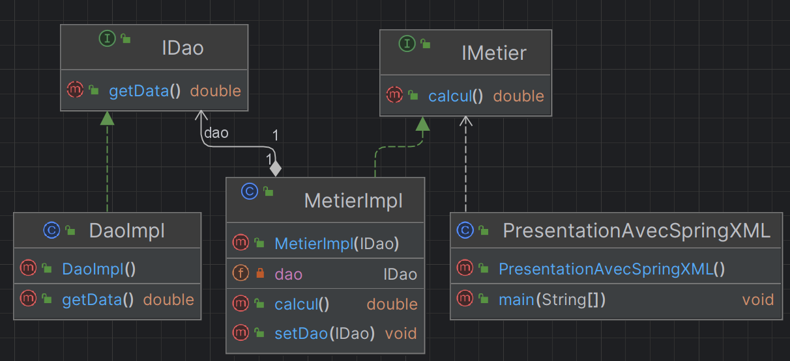
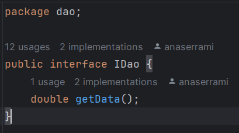
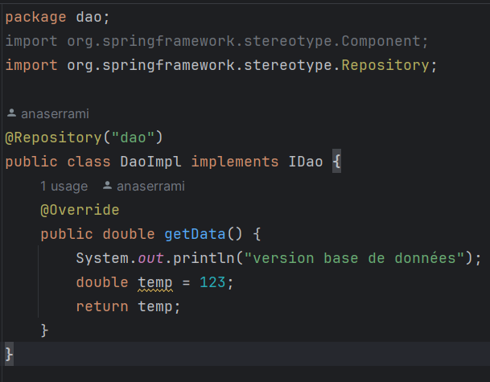
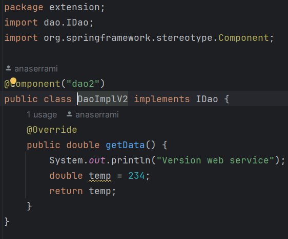
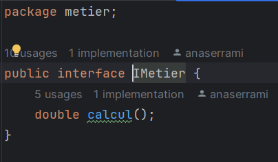
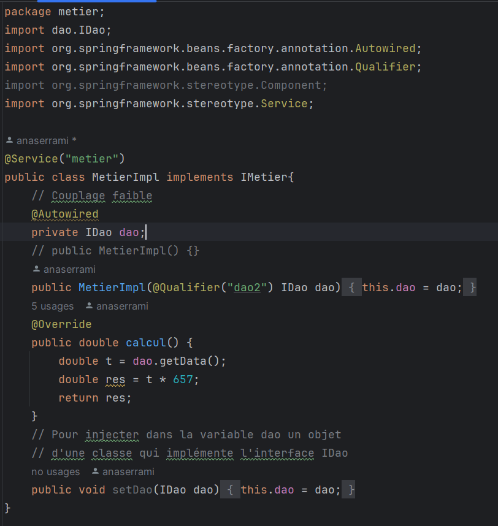
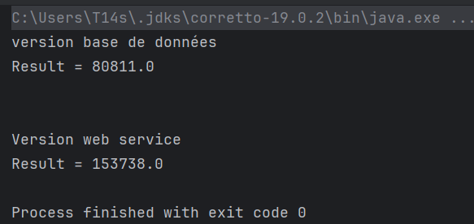
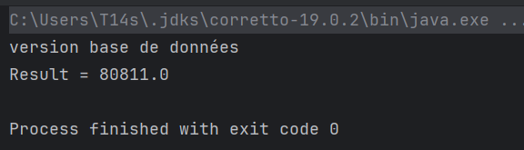
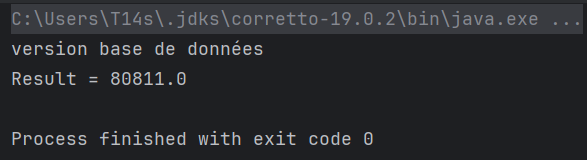

# Rapport - Application d'Inversion de Contrôle et Injection de Dépendances

## Introduction
Ce projet consiste en la création d'une application Java démontrant l'utilisation de l'Inversion de Contrôle (IoC) et de l'Injection de Dépendances (DI) selon les spécifications données. L'objectif est de comprendre et d'illustrer les différents mécanismes d'injection de dépendances, y compris l'injection par instanciation statique, par instanciation dynamique et en utilisant le framework Spring avec les versions XML et annotations.

## Fonctionnalités
- DaoImpl.java et IDao.java : Ces fichiers définissent une interface IDao avec une méthode getData et une implémentation DaoImpl qui retourne une valeur factice à des fins de démonstration.

- DaoImplV2.java : Une implémentation alternative de l'interface IDao qui simule une autre source de données.

- IMetier.java et MetierImpl.java : Ces fichiers définissent une interface IMetier avec une méthode calcul et une implémentation MetierImpl qui utilise l'interface IDao pour effectuer des calculs.

#### Injection des Dépendances :

- Par Instanciation Statique (PresentationV1.java) : Les dépendances sont injectées en créant manuellement les instances des classes nécessaires.

- Par Instanciation Dynamique (PresentationV2.java) : Les dépendances sont injectées en lisant les noms de classe à partir d'un fichier de configuration et en utilisant la réflexion pour créer les instances.

- Avec Spring (PresentationAvecSpringXML.java et PresentationSpringAnnotation.java) : Les dépendances sont gérées par Spring en utilisant les configurations XML et les annotations respectivement.

  - Version XML

  

  - Version annotations

  